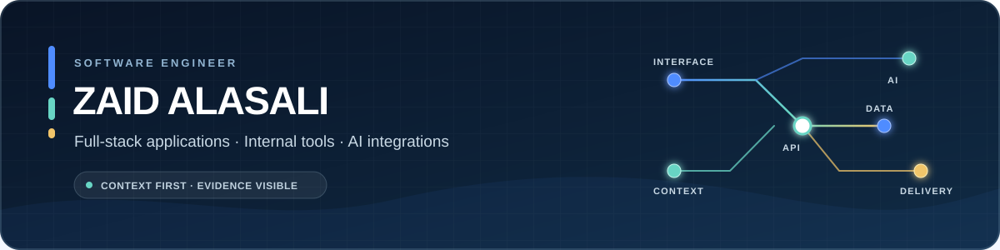

  

  <a href="https://differentdesign.pro/">Selected work</a>
  &nbsp;·&nbsp;
  <a href="https://www.linkedin.com/in/zaidalasali/">LinkedIn</a>
  &nbsp;·&nbsp;
  <a href="mailto:ZaidNaderAlAsali@outlook.com">Email</a>
  &nbsp;·&nbsp;
  <a href="https://github.com/ZaidNAlAsali?tab=repositories">Repositories</a>

## I build software that holds up beyond the demo.

I am a software engineer and 2026 Computer Science graduate focused on full-stack applications, internal tools, and AI-integrated workflows. I work across product UI, APIs, data, automation, testing, and delivery, with production experience supporting organizations in Jordan and the UAE.

My strongest work combines a clear user experience with careful engineering boundaries: human review around AI recommendations, local-first desktop safety, measurable performance, and verification that another engineer can reproduce.

Based in Debrecen, Hungary. Native Arabic speaker with C2 English proficiency. Open to full-time software engineering roles across the GCC and internationally.

## Featured engineering work

<table>
  <tr>
    <td width="50%" valign="top">
      
      <h3><a href="https://github.com/ZaidNAlAsali/signaldesk">SignalDesk</a></h3>
      
Bilingual English/Arabic operations decision console with policy-grounded AI triage, PII redaction, WebSocket updates, explicit human review, and tamper-evident audit history.

      
<strong>Verified:</strong> 24 automated tests, 85.69% backend coverage, a 24-case bilingual regression suite, PostgreSQL Compose workflows, append-only database controls, and green CI.

      
<code>Next.js</code> <code>TypeScript</code> <code>FastAPI</code> <code>PostgreSQL</code> <code>Docker</code>

      
<a href="https://github.com/ZaidNAlAsali/signaldesk">Repository</a> · <a href="https://github.com/ZaidNAlAsali/signaldesk/releases/tag/v0.3.0">Release 0.3.0</a> · <a href="https://github.com/ZaidNAlAsali/signaldesk/actions">CI</a>

    </td>
    <td width="50%" valign="top">
      
      <h3><a href="https://github.com/ZaidNAlAsali/filenest">FileNest</a></h3>
      
Privacy-first Windows file organizer with selected-folder scanning, streaming BLAKE3 duplicate detection, FTS5 search, move-only cleanup plans, local journaling, and integrity-checked undo.

      
<strong>Verified:</strong> 20 Rust tests, 8 frontend tests, green Windows CI, an install-tested NSIS release, and median scanner throughput of 5,042 files/second across five runs on 10,000 synthetic files.

      
<code>Rust</code> <code>Tauri 2</code> <code>React</code> <code>TypeScript</code> <code>SQLite</code>

      
<a href="https://github.com/ZaidNAlAsali/filenest">Repository</a> · <a href="https://github.com/ZaidNAlAsali/filenest/releases/tag/v0.1.1">Release 0.1.1</a> · <a href="https://github.com/ZaidNAlAsali/filenest/actions">CI</a>

    </td>
  </tr>
</table>

## Production work

### [Different Design](https://differentdesign.pro/)

Delivered a production React/Vite website end to end, covering frontend architecture, responsive UI, content and asset integration, deployment, domain configuration, documentation, and stakeholder handoff. Performance work included lazy loading, code splitting, tree shaking, and WebP assets, resulting in 95+ Lighthouse performance scores and an approximately 40% smaller bundle.

## Engineering focus

| Product and interface | Backend and systems | AI and automation |
| --- | --- | --- |
| React, Next.js, Vite, TypeScript, responsive design, accessibility | Node.js, FastAPI, Flask, REST APIs, PostgreSQL, SQLite, WebSockets | Provider integrations, structured outputs, retrieval workflows, PII-aware boundaries |
| Clear workflows, useful empty states, performance, handoff | Data modeling, migrations, auditability, recovery, failure handling | Human review, policy grounding, reproducible evaluation |

**Additional tools:** Rust, C++, SQL, Docker, GitHub Actions, AWS EC2/S3, Linux, Jest, React Testing Library, Ruff, Pytest, Lighthouse.

## How I approach engineering

1. **Understand the operating context.** Who makes the decision, what can fail, and what must remain recoverable?
2. **Make boundaries visible.** AI recommends but does not silently approve. File tools plan moves but do not silently delete.
3. **Ship evidence with the product.** Tests, CI, benchmarks, screenshots, release notes, and documented limitations are part of delivery.
4. **Keep the interface human.** A technically correct system still fails if its workflow is confusing.

## Currently

- Looking for full-time software engineering roles in the GCC and internationally.
- Interested in full-stack product engineering, internal platforms, applied AI, developer tools, and systems with meaningful safety or reliability constraints.
- Continuing to deepen my work in Rust, Python services, local-first software, and agent infrastructure.

  <strong>Let’s build something useful.</strong> 
  <a href="mailto:ZaidNaderAlAsali@outlook.com">ZaidNaderAlAsali@outlook.com</a>

