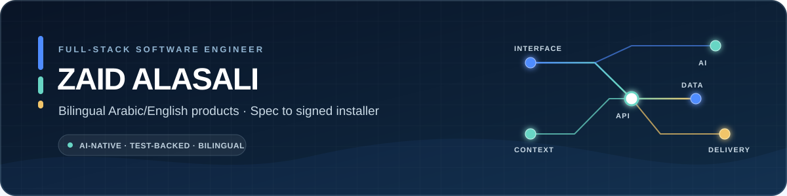
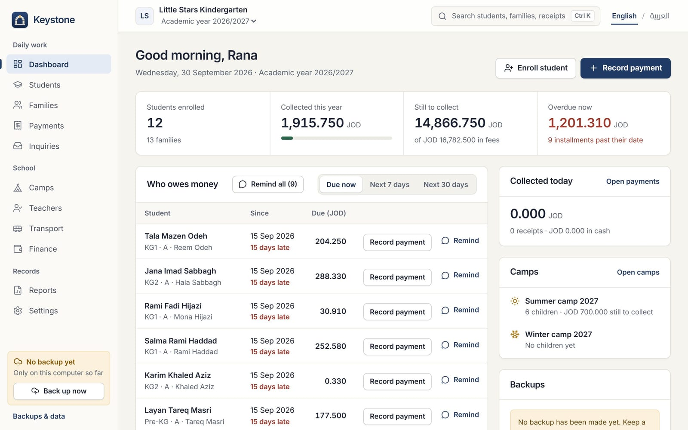
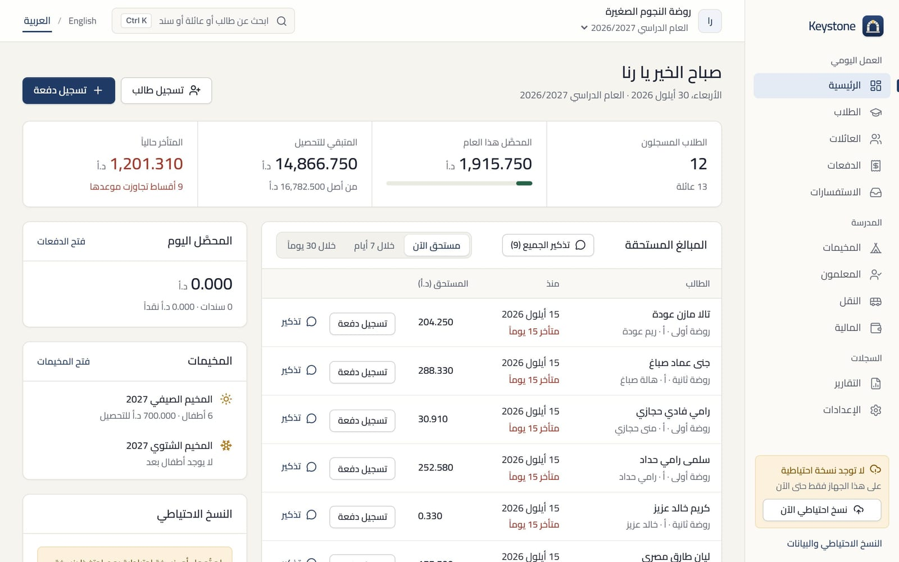
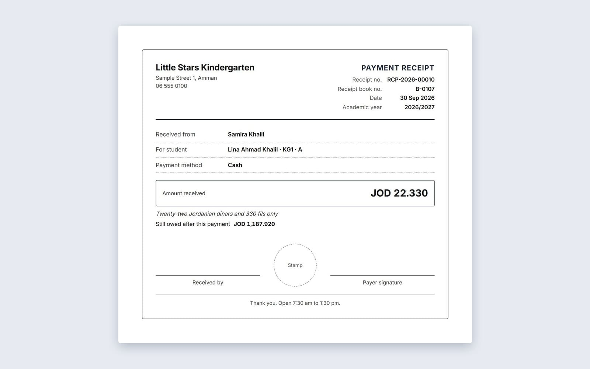

  

  <a href="#keystone">Keystone</a>
  &nbsp;&middot;&nbsp;
  <a href="#selected-work">Selected work</a>
  &nbsp;&middot;&nbsp;
  <a href="https://www.linkedin.com/in/zaidalasali/">LinkedIn</a>
  &nbsp;&middot;&nbsp;
  <a href="mailto:ZaidNaderAlAsali@outlook.com">Email</a>

<strong>Full-stack engineer who builds bilingual Arabic/English products, from the first spec to the signed installer.</strong> 
AI-native: I write the spec, own the architecture and direct coding agents like Claude Code and Codex, then prove the work with tests and CI. 
Amman, Jordan &middot; Open to roles in Doha, Qatar and the GCC &middot; Available immediately

## Keystone

A school management system for a kindergarten in Amman, built to replace the paid platform its office was using: enrollment, fees and installments, receipts, payroll and printed agreements, in Arabic and English with full right-to-left support.

<table>
  <tr>
    <td width="50%" valign="top"></td>
    <td width="50%" valign="top"></td>
  </tr>
</table>

- **How I built it:** I audited the old platform feature by feature, wrote the spec and set the architecture, then directed Claude Code through the build. Two weeks from first commit to signed installer.
- **Offline-first desktop app:** Next.js 16 and React 19 inside Electron, SQLite with versioned migrations, verified daily backups and Ed25519-signed updates.
- **Money that always adds up:** amounts stored as integer fils, installments that sum exactly, and voided payments that keep their receipt number.
- **Arabic done properly:** receipts and agreements write amounts in grammatically correct Arabic words, in full right-to-left layouts.
- **Proof:** 188 automated tests, plus lint, type checks and a production build on every push in Windows CI.

Printed receipt

 

The repository is private because it runs a real school. The screenshots use a fictional school, and every name and amount in them is invented.

## Selected work

<table>
  <tr>
    <td width="50%" valign="top">
      
      <h3><a href="https://github.com/ZaidNAlAsali/signaldesk">SignalDesk</a></h3>
      
Bilingual Arabic/English AI triage console. An LLM sorts requests against retrieved policy, personal data is redacted before any model call, a human approves or overrides every decision, and every step lands in a hash-chained audit log. <strong>Portfolio demo, not publicly deployed.</strong>

      
<strong>Evidence:</strong> the <a href="https://github.com/ZaidNAlAsali/signaldesk/actions/runs/29211319312">verified main CI run</a> passed 15 backend tests (86.73% coverage) and 9 frontend tests, and the <a href="https://github.com/ZaidNAlAsali/signaldesk/blob/main/services/api/eval/results/demo-evaluation.json">bilingual regression set</a> passes 24/24.

      
<code>Next.js</code> <code>TypeScript</code> <code>FastAPI</code> <code>PostgreSQL</code> <code>Docker</code>

    </td>
    <td width="50%" valign="top">
      
      <h3><a href="https://differentdesign.pro/">Different Design</a> <small>Dubai, UAE</small></h3>
      
Designed, built and launched a Dubai creative studio's website as its only engineer, from UI, imagery and SEO to domain, hosting and handoff. Web Developer and Technical Lead, Jun 2025 to Feb 2026.

      
<strong>Live evidence:</strong> the deployed site's metadata credits <strong>Zaid Nader AlAsali</strong> as developer.

      
<code>React</code> <code>Vite</code> <code>Framer Motion</code> <code>Vercel</code>

    </td>
  </tr>
  <tr>
    <td width="50%" valign="top">
      <h3><a href="https://github.com/ZaidNAlAsali/ZFileConverter">ZFileConverter</a></h3>
      
Relaunched an open-source Windows Explorer file converter: a rebuilt WPF interface with dark and light themes, PDF to DOCX, output validation and SHA-256-verified updates, shipped as MSI releases.

      
 

      
<code>C#</code> <code>.NET</code> <code>WPF</code> <code>WiX</code> <code>GitHub Actions</code>

    </td>
    <td width="50%" valign="top">
      <h3><a href="https://github.com/ZaidNAlAsali/filenest">FileNest</a></h3>
      
Offline Windows file organizer: streaming BLAKE3 duplicate detection, FTS5 search, move-only cleanup plans and integrity-checked undo.

      
<strong>Evidence:</strong> <a href="https://github.com/ZaidNAlAsali/filenest/actions/runs/29206861576">Windows CI</a> passed 20 Rust and 8 frontend tests and built the NSIS installer.

      
<code>Rust</code> <code>Tauri 2</code> <code>React</code> <code>SQLite</code>

    </td>
  </tr>
</table>

## Core stack

**Build:** TypeScript · React / Next.js / Vite · Node.js · Python / FastAPI · C# / .NET / WPF · PostgreSQL / SQLite · Electron / Tauri · Docker · GitHub Actions

**AI:** Claude Code and Codex (agentic coding) · OpenAI, Claude and Gemini APIs · RAG · structured outputs · evals

## Education and certifications

**BSc Computer Science**, University of Debrecen, Hungary (2026), on a Stipendium Hungaricum government scholarship. Thesis: an AI pipeline that turns text prompts into VR-ready 3D heritage assets (Hunyuan3D 2.0, Blender, Unity, Meta Quest 3).

Microsoft Certified: Azure AI Fundamentals (AI-900) · Information Technology Specialist: Software Development, HTML and CSS · NVIDIA DLI: Fundamentals of Deep Learning, Generative AI with Diffusion Models

  <strong>Let's build something useful.</strong> 
  <a href="mailto:ZaidNaderAlAsali@outlook.com">ZaidNaderAlAsali@outlook.com</a>

